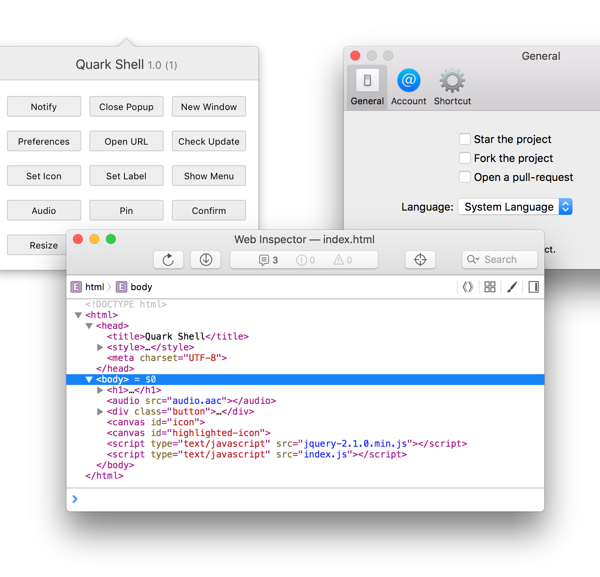

# Quark Shell for Mac

**Quark Shell** helps you create cross-platform (currently Mac and Windows) menubar/tray app using HTML and JavaScript without writing any native code. Quark Shell exposes a JavaScript object called ``quark`` to provide system functions. **Quark Shell for Mac** is based on WebKit.



## API

APIs may change rapidly before 1.0.

```js
quark.platform // returns "mac" or "windows"

// App info (configurable in Xcode)
quark.appVersion
quark.appBundleVersion

// Enable/disable Web Inspector
quark.debug = true

// Open/close the popup window
quark.openPopup()
quark.closePopup()

// Quit application
quark.quit()

// Open URL in default browser
quark.openURL("http://pomotodo.com")

// Set menubar icon
quark.setMenubarIcon("data:image/png;base64,iVBORw...SuQmCC")
quark.setMenubarHighlightedIcon("data:image/png;base64,iVBORw...SuQmCC")
quark.resetMenubarIcon()

// Auto start with system
quark.setAutoStart(true) // not implemented yet

// Send system notification
quark.notify({
  title: "Pomotodo",
  content: "Break is over!",
  time: "2038-01-19T03:14:07Z", // (optional) delivery date for scheduled notification, in ISO 8601
  popupOnClick: true // popup when clicking notification
})

// Remove all scheduled notifications
quark.removeAllScheduledNotifications()

// Remove all delivered notifications from notification center
quark.removeAllDeliveredNotifications()

// Open new window
// "url" is relative to "app" folder
// Notice: You can only open one window at the same time,
// or the later window will replace the former window.
quark.newWindow({
  url: "about.html",
  width: 600,
  height: 400,

  // optional options
  x: 100, y: 100, // x and y should both be provided, "center" is also a valid value
  border: true, // whether the window has a border, default is true
  shadow: true, // whether the window has a shadow, default is true
  alwaysOnTop: false, // whether the window should always on top, default is false
  alpha: 1.0 // the alpha value of the window, between 0 and 1, default is 1.0
})

// Close new window
quark.closeWindow()

// Pin/unpin pop-up window (won’t close when click outside the window)
quark.pin()
quark.unpin()

// Exchange messages between webviews
quark.emit("MessageName", "payload")
quark.on("MessageName", function(message) {
	console.log(message)
})

// Show a context menu
quark.showMenu({
  items: [
    {label: "Test", click: function() { console.log("I am completely operational") } },
    {type: "separator"},
    {label: "Exit", click: function() { console.log("LIFE FUNCTION TERMINATED") } }
  ],
  x: 100,
  y: 200
])
```

### Global Shortcuts

```js
// Set global keyboard shortcut
quark.addKeyboardShortcut({
  keycode: 0x7A, // F1 key
  modifierFlags: 0, // no modifier key
  callback: function suchCallback() {
    console.log("wow")
    quark.openPopup()
  }
})

// Clear global keyboard shortcut
quark.clearKeyboardShortcut()
```

Please follow [NSEvent Class Reference](https://developer.apple.com/library/mac/documentation/Cocoa/Reference/ApplicationKit/Classes/NSEvent_Class/Reference/Reference.html#//apple_ref/doc/constant_group/Modifier_Flags) for documentation about modifier flags.

Also, Quark Shell for Mac allows you to record shortcuts via [native components in Preferences window](Docs/Preferences.md#native-components).

### Preferences

```js
quark.setupPreferences([
  {"label": "General",  "identifier": "general",  "icon": "NSPreferencesGeneral", "height": 192},
  {"label": "Account",  "identifier": "account",  "icon": "NSUserAccounts",       "height": 102},
  {"label": "Shortcut", "identifier": "shortcut", "icon": "NSAdvanced",           "height": 120}
])

// Must be called after quark.setupPreferences()
quark.openPreferences()
quark.closePreferences()
```

Quark Shell for Mac also provides some native components for preferences.

More detail: [Preferences.md](Docs/Preferences.md)

### Auto Update

```js
// Check for update
quark.checkUpdate("https://rawgit.com/HackPlan/quark-shell-mac/master/updater/SampleAppcast.xml")
quark.checkUpdateInBackground("https://rawgit.com/HackPlan/quark-shell-mac/master/updater/SampleAppcast.xml")
```

More detail: [AutoUpdate.md](Docs/AutoUpdate.md)

## Integrating Web App

``app/index.html`` is the portal of your menubar app. ``app/preferences/[identifier].html`` are the preference pages (for example, ``app/preferences/general.html``).

To build your app:

0. Delete the current ``app`` folder
0. Put your files into the ``app`` folder
0. [Install CocoaPods](http://guides.cocoapods.org/using/getting-started.html)
0. ``cd`` into the project folder and run ``pod install``
0. Open ``quark-shell.xcworkspace`` in Xcode
0. Build and have fun!

Remember that Quark Shell is still a WIP. When the project is stable enough, I will definitely simplify the build process.

## FAQ
* Can I use **local storage**? Yes.
* Can I use **WebSQL**? Yes.
* Is Quark Shell compatible with Mac App Store? Absolutely yes.
* Do you guys have a plan for Linux version? Yes, we love Linux.

## Story

Quark Shell was originally Menubar WebKit, it was created for [Pomotodo for Mac](https://pomotodo.com/apps). Later on, we decided to create a Windows version based on Atom Shell. The project is highly inspired by [Atom Shell](https://github.com/atom/atom-shell), [node-webkit](https://github.com/rogerwang/node-webkit), and [MacGap](https://github.com/maccman/macgap). As a cross-platform project, Menubar WebKit is no longer appropriate, so we started to use Quark Shell.

## Credits

**Quark Shell for Mac** was created by **[LIU Dongyuan (@xhacker)](https://github.com/xhacker)** in the development of [Pomotodo for Mac](https://pomotodo.com).

Some of the code are taken from:

* [MacGap](https://github.com/maccman/macgap) by [@maccman](https://github.com/maccman)
* [Bang](https://github.com/jesseXu/Bang) by [@jesseXu](https://github.com/jesseXu)
* [Cordova OS X](https://github.com/apache/cordova-osx) by [Apache](http://www.apache.org)

Used third-party libraries:

* [MASShortcut](https://github.com/shpakovski/MASShortcut) by [@shpakovski](https://github.com/shpakovski)
* [RHPreferences](https://github.com/heardrwt/RHPreferences) by [@heardrwt](https://github.com/heardrwt)
* [Sparkle](https://github.com/sparkle-project/Sparkle) by [contributors](https://github.com/sparkle-project/Sparkle/graphs/contributors)

## Contribution

Pull requests are welcome! If you want to do something big, please open an issue first.

## License

MIT
